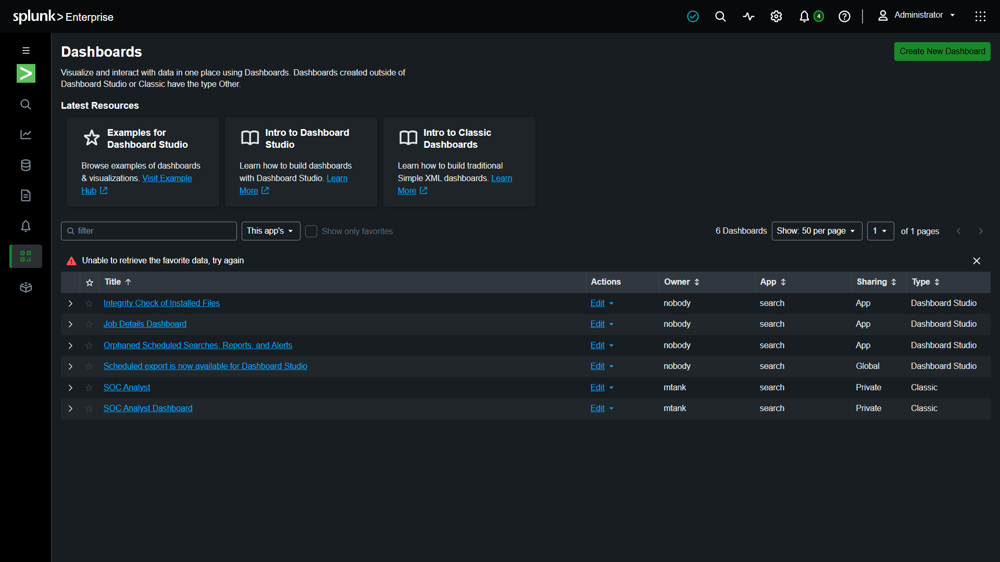

# 🛡️ Security Event Monitoring using Splunk

> A complete SOC Analyst Home Lab built using Splunk Enterprise, Sysmon, Windows Event Logs, and MITRE ATT&CK for real-time security monitoring, threat hunting, and detection engineering.

---

## 📌 Project Overview

### Project Objective

Organizations generate thousands of security logs every day. This project demonstrates how a SOC Analyst can centralize Windows endpoint logs using Splunk Enterprise to detect malicious activities, investigate incidents, and perform proactive threat hunting.

### Goals

✔ Collect Windows Security Logs

✔ Collect Sysmon Logs

✔ Build Security Dashboards

✔ Detect Suspicious Activities

✔ Create Threat Hunting Queries

✔ Generate Alerts

✔ Map detections with MITRE ATT&CK

---

## 🛠️ Tools Used

| Tool | Purpose |
|------|---------|
| Splunk Enterprise | SIEM Platform |
| Sysmon | Endpoint Telemetry |
| Universal Forwarder | Log Collection |
| Windows Event Logs | Authentication Logs |
| SPL | Search Language |
| MITRE ATT&CK | Threat Mapping |

---

## 🏗️ Architecture

Windows Endpoint

↓

Windows Event Logs

↓

Sysmon

↓

Splunk Universal Forwarder

↓

Splunk Enterprise

↓

Search Processing Language

↓

Dashboards • Alerts • Reports

---

## 📊 Dashboards

### Successful Logins

Purpose

Monitor successful Windows logins.

Example

Event ID 4624

Screenshot


---

### Failed Logins

Purpose

Detect brute-force attacks.

Example

Event ID 4625

Screenshot


---

### Process Creation

Purpose

Monitor process execution.

Example

powershell.exe

cmd.exe

reg.exe

Screenshot


---

## 🔍 Threat Hunting Queries

### Detect PowerShell

```spl
index=sysmon EventCode=1 Image="*powershell.exe"
| table _time CommandLine ParentImage User
```

Purpose

Detect malicious PowerShell execution.

---

### Detect Registry Persistence

```spl
index=sysmon EventCode=13
TargetObject="*\\Run*"
```

Purpose

Detect persistence techniques.

---

### Detect Network Connections

```spl
index=sysmon EventCode=3
```

Purpose

Monitor outbound connections.

---

## 🚨 Detection Rules

| Detection | Description |
|-----------|-------------|
| Failed Login | More than 5 failed logins |
| PowerShell | PowerShell execution |
| Registry Persistence | Startup Registry Keys |
| Suspicious Process | mimikatz.exe |

---

## 🎯 MITRE ATT&CK Mapping

| Event | Technique |
|--------|-----------|
| Process Creation | T1059 |
| Network Connections | T1049 |
| Registry Changes | T1112 |
| DNS Queries | T1071.004 |

---

## 📷 Screenshots

### Dashboard



---

### Threat Hunting


---

### Alerts


---

## 📚 Skills Demonstrated

✔ SIEM Administration

✔ Log Analysis

✔ Windows Event Monitoring

✔ Sysmon Configuration

✔ Detection Engineering

✔ SPL Query Writing

✔ Threat Hunting

✔ MITRE ATT&CK Mapping

✔ Security Dashboard Development

✔ Incident Investigation

---

## 🚀 Future Improvements

- Integrate Microsoft Defender Logs
- Sigma Rule Conversion
- Atomic Red Team Simulations
- Linux Endpoint Monitoring
- Threat Intelligence Integration

---

## 👨‍💻 Author

Sahil Sonawane

Aspiring SOC Analyst

GitHub: https://github.com/MTanK2305
